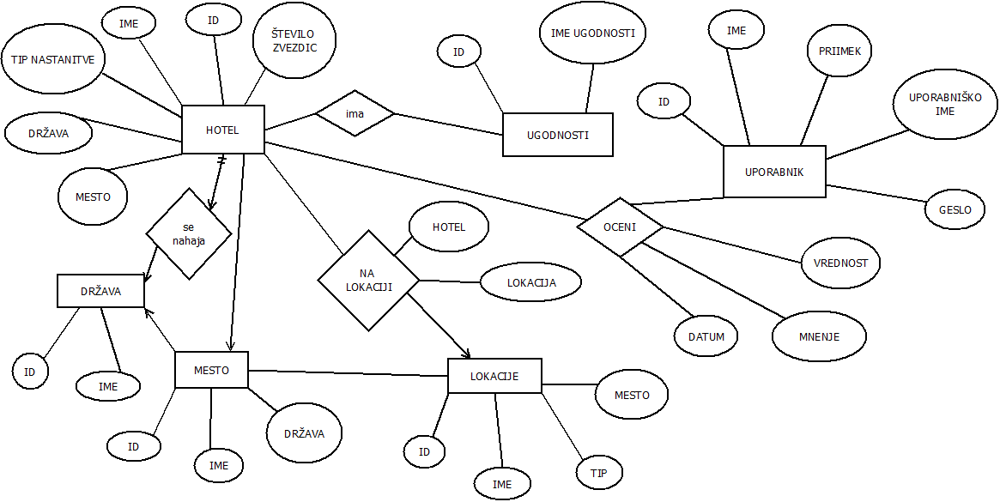

# looking.si

Ideja najinega projekta je iskanje hotela glede na lastnosti, ki si jih želimo. Dodali sva več kategorij, med katerimi lahko izbiramo. Prijaviti se je mogoče kot uporabnik ali administrator. Asistent in profeosr se lahko registrirata kot administrator na način, da za uporabniško ime pri registraciji uporabita `asistent` oziroma `profesor`.

V primeru, da se bomo prijavili kot uporabnik, bomo lahko brskali med hoteli in iskali tistega, ki ustreza našim zahtevam, prav tako pa bomo lahko izbrani hotel tudi ocenili in podali mnenje. 
Če pa se bomo prijavili kot administrator, bomo lahko še dodajali nove hotele v bazo, prav tako tudi države, mesta, okrožja in znamenitosti. 
Lahko pa aplikacijo uporabljamo tudi, če nismo prijavljeni. V tem primeru lahko iščemo hotele in izbiramo različne značilnosti, ne moremo pa podati komentarja in oceniti hotel. Lahko pa kot neprijavljeni vidimo vsa mnenja in ocene, ki so jih dodali drugi uporaniki.

Prilagava še sliko ER-diagrama, na podlagi katerega sva osnovali bazo:

